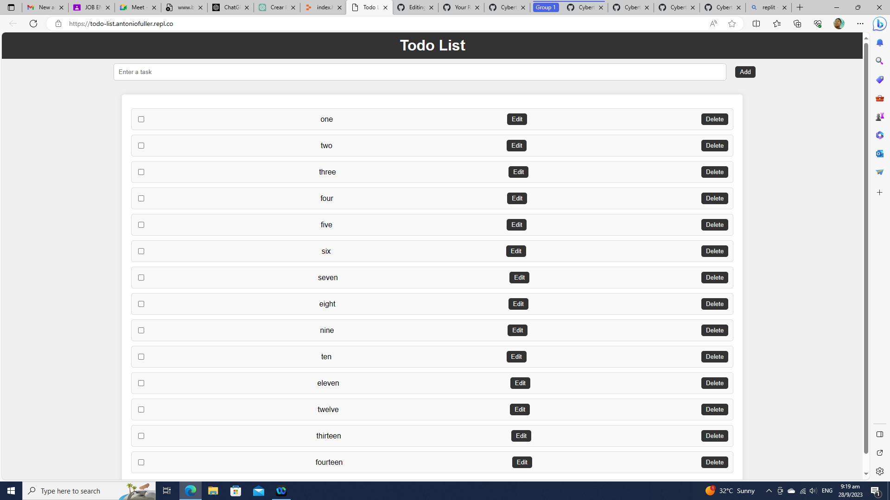

# todo_list

# Simple To-Do List

This is a simple to-do list application that allows you to add, edit, mark tasks as completed, and delete tasks. It's built using HTML, CSS, and JavaScript, and it's designed to be responsive on mobile, tablet, and computer screens.

## Features

- Add tasks: Enter a task and click the "Add" button to add it to the list.
- Edit tasks: Click the "Edit" button to edit a task, and then click "Save" to save your changes.
- Mark tasks as completed: Use the checkbox to mark tasks as completed. Completed tasks are displayed with a strike-through effect.
- Delete tasks: Click the "Delete" button to remove a task from the list.

## Demo

You can try the live demo of this to-do list application [here](https://your-demo-link-here.com).

## Getting Started

To run this application locally, follow these steps:

1. Clone the repository to your local machine:

git clone https://github.com/Cybertron-Ant/todo_list

2. Open the `index.html` file in your web browser.

## Usage

1. Enter a task in the input field and click the "Add" button to add it to your to-do list.

2. Use the "Edit" button to edit a task. Click "Save" to save your changes.

3. Use the checkbox to mark tasks as completed or incomplete.

4. Click the "Delete" button to remove a task from the list.

## Customization

You can customize the styles and appearance of the to-do list by modifying the `styles.css` file.

## Contributing

Contributions are welcome! If you'd like to contribute to this project, please open an issue or submit a pull request.

## License

This project is licensed under the MIT License - see the [LICENSE](LICENSE) file for details.

## Acknowledgments

- This project was inspired by [insert source or inspiration here].
- Special thanks to [mention any contributors or libraries used].
